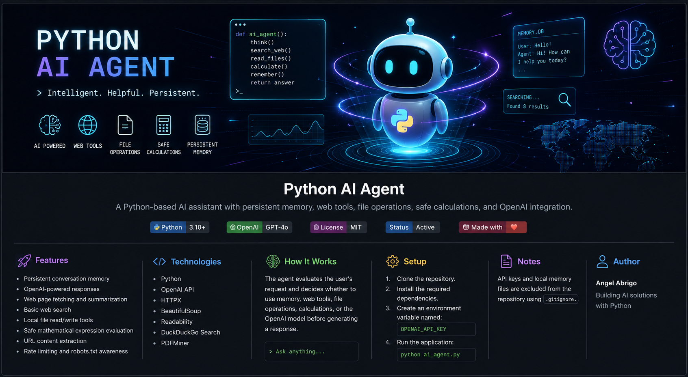

<p align="center">
  
</p>
# Python AI Agent

A Python-based AI assistant with persistent memory, web tools, file operations, safe calculations, and OpenAI integration.

## Features

- Persistent conversation memory
- OpenAI-powered responses
- Web page fetching and summarization
- Basic web search
- Local file read/write tools
- Safe mathematical expression evaluation
- URL content extraction
- Rate limiting and robots.txt awareness

## Technologies

- Python
- OpenAI API
- HTTPX
- BeautifulSoup
- Readability
- DuckDuckGo Search
- PDFMiner

## How It Works

The agent evaluates the user's request and decides whether to use memory, web tools, file operations, calculations, or the OpenAI model before generating a response.

## Setup

1. Clone the repository.
2. Install the required dependencies.
3. Create an environment variable named:

```bash
OPENAI_API_KEY
```

4. Run the application:

```bash
python ai_agent.py
```

## Notes

API keys and local memory files are excluded from the repository using `.gitignore`.

## Author

Angel Abrigo
